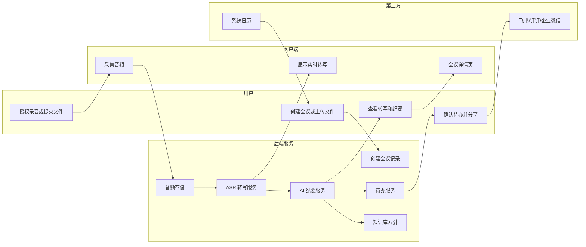
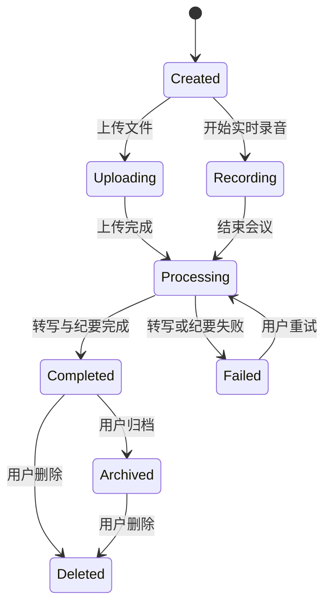
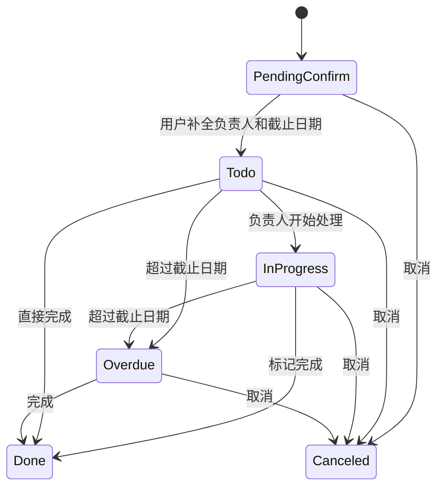
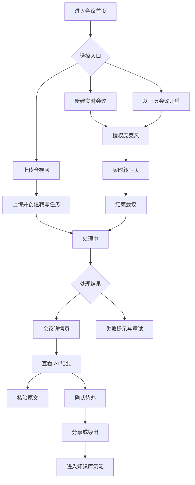
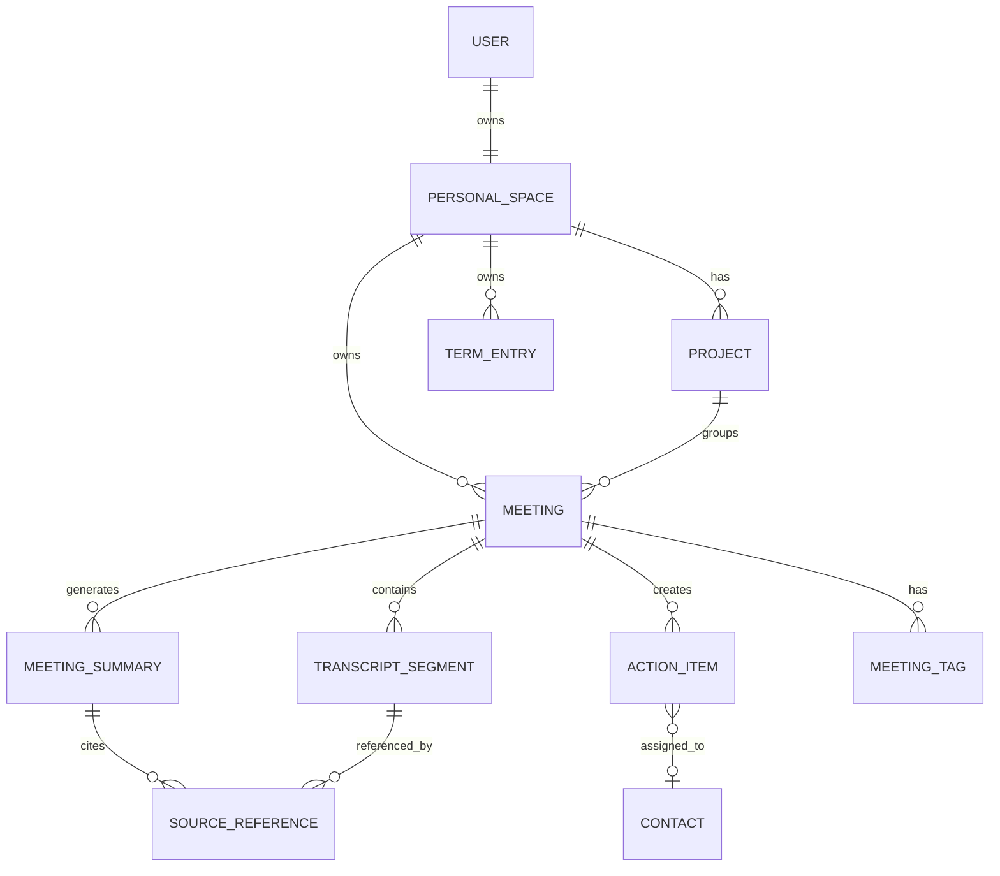

# 会晓 AI APP 端产品需求文档 PRD V1.2 最终稿

## 一、文档基础信息

### 1.1 文档概览

| 项目 | 内容 |
|---|---|
| 文档标题 | 会晓 AI APP 端产品需求文档 PRD |
| 产品名称 | 会晓 AI |
| 产品定位 | AI 会议知识与行动平台 |
| 文档版本 | V1.2 |
| 文档状态 | Draft |
| 撰写人 | Codex PM |
| 撰写日期 | 2026-05-20 |
| 最后更新时间 | 2026-05-20 |
| 适用范围 | iOS APP、Android APP |
| 目标版本 | 会晓 AI APP V1.2 首发上线版本 |
| 目标用户 | 高频开会的知识工作者、移动办公用户、中小团队成员、项目经理、销售、咨询顾问、HR、法务与个人效率用户 |

### 1.2 修订历史

| 版本号 | 修改日期 | 修改人 | 修改内容摘要 | 审核人 |
|---|---|---|---|---|
| V0.1 | 2026-05-20 | Codex PM | 基于竞品分析与市场调研形成 PRD 初稿结构 | 待定 |
| V1.0 | 2026-05-20 | Codex PM | 完成产品目标、需求清单、功能详情、流程、数据、非功能需求 | 待定 |
| V1.1 | 2026-05-20 | Codex PM | 删除企业后台模块，产品范围收敛为 iOS/Android APP 首发版本 | 待定 |
| V1.2 | 2026-05-20 | Codex PM | 根据 PRD 评审补充移动端录音生命周期、AI 质量验收、P0 用户故事验收、APP 数据模型与实施节奏 | 待定 |

### 1.3 名词解释

| 名词 | 解释 |
|---|---|
| ASR | Automatic Speech Recognition，自动语音识别，将语音转成文字 |
| LLM | Large Language Model，大语言模型，用于摘要、问答、待办提取、内容生成 |
| 实时转写 | 会议进行过程中边录音边生成文字稿 |
| 离线转写 | 用户上传音频或视频文件后，系统异步生成文字稿 |
| 说话人分离 | 将不同发言人的语音片段区分开，标记为说话人 A、B 或真实姓名 |
| 声纹识别 | 基于声音特征识别发言人身份，需用户授权 |
| AI 纪要 | 系统基于转写文本自动生成会议摘要、结论、待办、风险、问题等结构化内容 |
| 可核验纪要 | AI 生成的每条摘要、结论、待办均能跳转到原文和音频时间点核对 |
| 置信度 | 系统对转写文本、发言人、摘要或待办准确性的可信评分 |
| 待办事项 | 从会议中提取出的任务，包含负责人、截止日期、状态、来源依据 |
| 会议知识库 | 按团队、项目、客户、标签沉淀的会议记录、纪要、任务和问答内容 |
| 跨会议问答 | 用户可以基于历史会议内容提问，例如“上周我答应了哪些事” |
| 个人空间 | APP 用户默认的数据空间，包含会议、项目、标签、模板、词库和同步设置 |
| P0/P1/P2 | 需求优先级。P0 为上线必须，P1 为重要增强，P2 为后续优化 |
| DAU | Daily Active Users，日活跃用户数 |
| WAU | Weekly Active Users，周活跃用户数 |
| 转写成功率 | 成功生成转写文本的会议数 / 发起转写的会议数 |
| 纪要采纳率 | 用户未大幅修改即保存或分享的 AI 纪要数 / 生成 AI 纪要数 |

### 1.4 项目背景

会议纪要类产品已经从单点的“录音转文字”升级为“会议后的知识与行动管理”。竞品调研显示：

1. 讯飞听见在语音识别、实时转写、多语种和企业方案上具备强优势，用户心智是“高准确率转写工具”。
2. 听脑 AI 已经开始从会议纪要延展到知识库、跨会议问答和多模板总结。
3. 简单录更偏移动端个人用户，覆盖录音、转写、翻译、字幕、小窗、降噪等多场景。
4. 飞书妙记、腾讯会议 AI 小助手、Zoom AI Companion 等协同平台正把会议纪要内置到会议与办公生态中。
5. 海外 Otter、Fireflies 等产品的方向是“AI Meeting Agent”，从转写、摘要向跨会议问答、任务系统集成、自动工作流演进。

当前市场存在明确机会：多数工具能“记下会议”，但不能稳定做到“结论可信、责任清楚、行动可追踪、历史可复用”。用户真正想解决的不是没有文字稿，而是会后仍然不知道谁负责、什么时候交付、决策依据在哪里、历史会议怎么查。

因此，会晓 AI 不应定位为普通录音转文字 APP，而应定位为“AI 会议知识与行动平台”。产品核心差异化是：可核验 AI 纪要、行动闭环、跨会议知识库。

### 1.5 产品目标

#### 1.5.1 北极星指标

| 指标 | 定义 | V1.2 目标 |
|---|---|---|
| 每周被完成的 AI 会议行动项数量 | 每周由 AI 从会议中生成，并被用户标记为完成的待办数量 | Beta 阶段达到每活跃团队每周 >= 6 条 |

#### 1.5.2 用户价值目标

| 目标 | 量化指标 | 目标值 |
|---|---|---|
| 降低会议纪要整理成本 | 30 分钟以上会议的纪要生成耗时 | 从人工 30-60 分钟降低到 3 分钟内 |
| 提升会议结论可信度 | AI 纪要中可点击回溯原文的条目占比 | P0 条目 100% 可回溯 |
| 提升行动落地率 | AI 待办被分配负责人和截止日期的比例 | >= 70% |
| 提升复查效率 | 用户查找历史会议结论的平均耗时 | 降低到 30 秒内 |
| 提升团队复用率 | 创建 3 场及以上会议的团队次周留存 | Beta 阶段 >= 35% |

#### 1.5.3 商业目标

| 目标 | 指标 | V1.2 目标 |
|---|---|---|
| 验证付费意愿 | 免费团队到付费团队转化率 | Beta 后 60 天 >= 5% |
| 验证团队协作价值 | 单团队平均席位数 | >= 4 人 |
| 验证高频场景 | 每活跃团队每周记录会议数 | >= 3 场 |
| 控制 AI 成本 | 单小时会议平均 AI 成本 | <= 用户收入的 25% |

## 二、需求分析

### 2.1 用户画像

#### 2.1.1 主要用户画像 A：高频开会的产品经理

| 维度 | 内容 |
|---|---|
| 典型用户 | 28-35 岁，互联网或 SaaS 公司产品经理 |
| 工作特征 | 每周 8-15 场会议，包括需求评审、项目同步、用户访谈、复盘会 |
| 常用工具 | 飞书/钉钉/企业微信、腾讯会议、飞书会议、Notion、Jira、禅道、Excel |
| 核心痛点 | 会议中要同时听、记、思考，容易漏掉结论和责任人；会后整理纪要耗时；跨会议查找历史决策困难 |
| 购买动机 | 节省纪要时间，减少遗漏，让团队行动项可追踪 |
| 典型故事 | 作为产品经理，我希望会议结束后 3 分钟内得到可核验的纪要和待办，以便快速同步团队并推进执行 |

#### 2.1.2 主要用户画像 B：项目经理/团队负责人

| 维度 | 内容 |
|---|---|
| 典型用户 | 30-45 岁，项目经理、交付经理、研发负责人、创业公司负责人 |
| 工作特征 | 关注多人协作、任务推进、项目风险、跨部门对齐 |
| 常用工具 | 企业微信、飞书、钉钉、腾讯会议、项目管理工具、日历 |
| 核心痛点 | 会上说了很多，但会后没人跟；项目风险散落在会议中；每周复盘要翻聊天记录和纪要 |
| 购买动机 | 把会议自动转成行动清单和项目风险清单，减少管理成本 |
| 典型故事 | 作为项目经理，我希望系统自动识别每次会议中的风险、阻塞和负责人，以便周会时直接追踪进度 |

#### 2.1.3 主要用户画像 C：销售/客户成功/咨询顾问

| 维度 | 内容 |
|---|---|
| 典型用户 | 25-40 岁，B2B 销售、售前、客户成功、咨询顾问 |
| 工作特征 | 高频客户会议，关注客户需求、异议、承诺、下一步动作 |
| 常用工具 | 企业微信、飞书、腾讯会议、Zoom、邮件、表格 |
| 核心痛点 | 客户表达的信息细碎，人工记录容易漏掉预算、决策链、竞品、需求优先级 |
| 购买动机 | 自动生成客户会议摘要、商机风险、下一步跟进事项，并通过 APP 分享或导出给团队 |
| 典型故事 | 作为销售，我希望客户会议结束后自动生成客户需求、异议、预算和下一步跟进，以便提升成交推进效率 |

#### 2.1.4 次要用户画像 D：HR 面试官

| 维度 | 内容 |
|---|---|
| 典型用户 | HRBP、招聘经理、业务面试官 |
| 工作特征 | 高频面试，需要记录候选人经历、亮点、风险和评价 |
| 核心痛点 | 面试时记笔记会影响交流；面试后写评价耗时；多个面试官评价口径不统一 |
| 购买动机 | 自动生成结构化面试记录和候选人评价草稿 |

#### 2.1.5 次要用户画像 E：法务/律师/审计

| 维度 | 内容 |
|---|---|
| 典型用户 | 律师、法务、审计、合规人员 |
| 工作特征 | 访谈、取证、调查、尽调、会议记录要求高 |
| 核心痛点 | 对原文准确性、证据链、数据安全和保密要求高 |
| 购买动机 | 可核验、可追溯、可导出、数据可控 |

### 2.2 用户需求

| 用户故事 ID | 用户故事 | 价值 |
|---|---|---|
| US-001 | 作为会议主持人，我希望一键创建会议并开始实时转写，以便不用手动记录完整发言 | 降低记录成本 |
| US-002 | 作为参会人，我希望看到实时字幕和发言人区分，以便快速跟上会议内容 | 提升会中理解 |
| US-003 | 作为产品经理，我希望会议结束后自动生成摘要、结论和待办，以便快速同步团队 | 提升会后效率 |
| US-004 | 作为项目经理，我希望每个待办都能绑定负责人、截止日期和来源原文，以便追踪执行 | 提升行动落地 |
| US-005 | 作为团队负责人，我希望可以跨会议查询“某项目最近的风险”，以便快速掌握项目状态 | 沉淀知识资产 |
| US-006 | 作为销售，我希望会议纪要能按客户拜访模板输出并一键分享给团队，以便减少手工整理 | 提升销售效率 |
| US-007 | 作为 APP 用户，我希望能管理录音权限、本地缓存、云端同步和删除记录，以便控制自己的会议数据 | 降低隐私风险 |
| US-008 | 作为用户，我希望 AI 生成内容能点回原文和音频，以便确认 AI 是否理解正确 | 建立信任 |

#### 2.2.1 P0 用户故事验收条件

| 用户故事 ID | 场景 | Given | When | Then |
|---|---|---|---|---|
| US-001 | 一键实时记录 | 用户已登录，麦克风权限已开启，转写额度充足 | 用户点击【开始记录】 | APP 在 3 秒内进入录音态，5 秒内展示首段转写或明确提示正在连接 |
| US-001 | 麦克风未授权 | 用户首次使用且未授权麦克风 | 用户点击【开始记录】 | APP 弹出系统权限申请；拒绝后展示权限开启指引，不创建空会议 |
| US-002 | 会中查看实时字幕 | 当前会议正在录音且 ASR 服务可用 | 有人持续发言 | APP 按时间顺序追加转写片段，并展示说话人标识和时间戳 |
| US-003 | 自动生成纪要 | 会议时长 >= 5 分钟且转写完成 | 用户结束会议 | APP 自动生成摘要、议题、决策、待办，失败时允许重试并保留转写稿 |
| US-004 | 确认待办 | AI 已提取待办草稿 | 用户补全或确认负责人、截止日期 | 待办状态从“待确认”变为“待处理”，并可在待办页查看 |
| US-007 | 删除会议数据 | 用户进入会议详情页 | 用户点击【删除会议】并二次确认 | APP 删除音频、转写、纪要、待办和知识库索引；已分享链接失效 |
| US-008 | 核验 AI 内容 | 会议纪要已生成 | 用户点击任一决策或待办的【来源】 | APP 底部弹出原文片段和音频播放器，并定位到对应时间点 |

### 2.3 需求清单

| 需求 ID | 功能描述 | 优先级 | 优先级说明 | 验收标准 | 涉及角色 |
|---|---|---|---|---|---|
| REQ-001 | 用户注册、登录、个人空间创建 | P0 | 无账号体系无法保存和跨设备同步 | 用户可手机号/邮箱/Apple ID 登录，默认创建个人空间 | 普通用户 |
| REQ-002 | 一键创建会议并实时录音转写 | P0 | 核心入口 | 用户点击开始后 3 秒内进入录音态，5 秒内出现首段转写 | 主持人、参会人 |
| REQ-003 | 上传音频/视频文件转写 | P0 | 覆盖会后整理场景 | 支持 mp3、m4a、wav、mp4、mov，上传后生成转写任务 | 普通用户 |
| REQ-004 | 说话人分离与名称编辑 | P0 | 纪要可读性核心 | 系统自动区分说话人，用户可批量重命名 | 普通用户 |
| REQ-005 | AI 会议纪要生成 | P0 | 产品核心价值 | 会议结束后自动生成摘要、结论、待办、风险、问题 | 普通用户 |
| REQ-006 | 可核验原文回溯 | P0 | 差异化核心 | 每条 AI 摘要、结论、待办均可跳转到对应原文和音频时间点 | 普通用户 |
| REQ-007 | 待办事项提取与状态管理 | P0 | 行动闭环核心 | 待办包含任务、负责人、截止日期、状态、来源，支持编辑与完成 | 主持人、项目经理 |
| REQ-008 | 会议详情页编辑与导出 | P0 | 基础交付能力 | 支持编辑转写、纪要、待办，导出 Markdown、Word、PDF、TXT | 普通用户 |
| REQ-009 | 分享会议纪要 | P0 | 移动端传播 | 支持系统分享面板、复制摘要、导出文件、发送到微信/企业微信/飞书/钉钉 | 普通用户 |
| REQ-010 | 会议列表与搜索 | P0 | 历史查找基础 | 支持按标题、内容、发言人、标签、项目搜索 | 普通用户 |
| REQ-011 | 项目/客户/标签归档 | P1 | 知识组织能力 | 会议可归入项目或客户，可添加标签 | 团队成员 |
| REQ-012 | 跨会议知识库问答 | P1 | 核心差异化增强 | 用户可基于本人可访问的会议提问，答案引用来源会议和时间点 | 普通用户 |
| REQ-013 | 会议模板库 | P1 | 提升垂直场景价值 | 支持周会、需求评审、客户拜访、面试、复盘等模板 | 普通用户 |
| REQ-014 | 专业术语词库 | P1 | 提升识别准确率 | 用户可在 APP 内维护个人/项目词库，转写时优先识别专有名词 | 普通用户 |
| REQ-015 | 日历会议提醒与快捷记录 | P1 | 提升 APP 使用频率 | 授权系统日历后识别会议标题和时间，到点提醒用户手动开启记录，用户可关闭提醒 | 普通用户 |
| REQ-016 | 第三方分享与轻量集成 | P1 | 移动端落地 | 支持通过系统分享面板发送纪要与待办到微信、企业微信、飞书、钉钉 | 普通用户 |
| REQ-017 | APP 数据与隐私管理 | P0 | APP 首发必须具备 | 用户可管理麦克风、通知、相册、日历权限，可删除会议和清理本地缓存 | 普通用户 |
| REQ-018 | 敏感内容提醒 | P2 | 隐私增强 | 对手机号、身份证、银行卡等敏感信息进行本地或云端提示 | 普通用户 |
| REQ-019 | 多语言转写与翻译 | P2 | 扩展跨国会议 | 支持中文、英文优先，后续扩展更多语言 | 普通用户 |

## 三、功能详情

### 3.1 功能模块总览

| 模块 | 功能概述 | 核心用户 | 优先级 |
|---|---|---|---|
| 账号与个人空间 | 支持登录、个人空间、跨设备同步和基础资料管理 | 普通用户 | P0 |
| 会议采集 | 支持 APP 实时录音、文件导入和日历入口 | 主持人、参会人 | P0/P1 |
| 转写与说话人 | 生成文字稿，区分说话人，支持编辑校正 | 普通用户 | P0 |
| AI 纪要 | 自动生成摘要、结论、待办、风险、问题、关键引用 | 普通用户 | P0 |
| 待办闭环 | 从会议提取任务，分配负责人，追踪状态 | 项目经理、团队成员 | P0 |
| 知识库问答 | 跨会议检索和问答，答案带来源引用 | 普通用户 | P1 |
| 分享与导出 | APP 内复制、导出、系统分享、IM 分享 | 普通用户 | P0/P1 |
| 模板与词库 | 按场景生成纪要，维护个人/项目专业术语 | 普通用户 | P1 |
| APP 数据与隐私 | 管理系统权限、本地缓存、云端同步和会议删除 | 普通用户 | P0 |

### 3.2 模块 A：账号与个人空间

#### 3.2.1 功能概述

账号与个人空间模块用于承载 APP 用户身份、会议数据归属、跨设备同步和基础资料管理。V1.2 首发不做复杂组织管理，仅支持个人空间和轻量项目成员标记。

#### 3.2.2 页面结构

| 页面 | 页面元素布局 |
|---|---|
| 启动页 | 产品 Logo、启动加载状态、网络异常重试入口 |
| 登录页 | 顶部产品 Logo；中间登录区域，包含手机号/邮箱输入框、验证码/密码输入框、登录按钮、Apple ID 登录入口；底部服务协议与隐私政策 |
| 个人空间页 | 展示用户头像、昵称、会员状态、云端同步状态、存储用量、常用设置入口 |
| APP 设置页 | 账号与安全、录音权限、通知权限、日历权限、本地缓存、云端同步、隐私设置、帮助与反馈 |

#### 3.2.3 交互逻辑

1. 用户打开产品，未登录时进入登录页。
2. 输入手机号或邮箱，点击获取验证码。
3. 验证成功后进入 APP 首页。
4. 新用户默认创建个人空间，系统展示首次使用引导。
5. 用户可在个人空间页开启云端同步。
6. 用户可在设置页管理麦克风、通知、日历、相册、文件访问等系统权限。
7. 用户退出登录后，本地未同步数据需明确提示用户是否保留。

#### 3.2.4 异常流程

| 场景 | 系统处理 |
|---|---|
| 验证码错误 | 输入框下方提示“验证码错误，请重新输入” |
| 验证码过期 | 提示“验证码已过期，请重新获取” |
| Apple ID 授权失败 | 提示“Apple ID 登录失败，请重试或使用手机号登录” |
| 云端同步失败 | 展示“同步失败，已保留在本地”，网络恢复后自动重试 |
| 退出登录存在未同步会议 | 二次确认“仍有未同步会议，退出后可能无法在其他设备查看” |

#### 3.2.5 规则描述

| 规则 | 描述 |
|---|---|
| 手机号 | 中国大陆手机号 11 位，后续支持海外手机号 |
| 邮箱 | 必须符合邮箱格式 |
| 昵称 | 2-20 个字符，不允许纯空格 |
| 云端同步 | 默认开启，用户可关闭；关闭后会议仅保存在本机 |
| 本地缓存 | 用户可手动清理，清理前提示未同步数据风险 |

#### 3.2.6 字段说明

| 字段名称 | 类型 | 长度 | 默认值 | 取值来源 | 是否必填 |
|---|---|---:|---|---|---|
| user_id | string | 36 | 系统生成 | 系统 | 是 |
| mobile | string | 20 | 空 | 用户输入 | 否 |
| email | string | 100 | 空 | 用户输入 | 否 |
| personal_space_id | string | 36 | 系统生成 | 系统 | 是 |
| nickname | string | 20 | 空 | 用户输入 | 否 |
| cloud_sync_enabled | boolean | - | true | 用户设置 | 是 |
| created_at | datetime | - | 当前时间 | 系统 | 是 |

### 3.3 模块 B：会议创建与采集

#### 3.3.1 功能概述

会议采集模块支持用户通过 APP 实时录音、本地音视频导入和日历提醒生成会议记录，是 APP 首发版本的核心入口。V1.2 不做线上会议自动入会助手，线上会议记录通过手机外放录音、系统文件导入或后续平台集成解决。

#### 3.3.2 功能清单

| 功能点 | 描述 | 优先级 | 涉及角色 |
|---|---|---|---|
| 一键实时录音 | 点击后立即创建会议并开始录音转写 | P0 | 主持人 |
| 文件上传转写 | 上传音频/视频生成转写任务 | P0 | 普通用户 |
| 会议基础信息编辑 | 编辑标题、时间、项目、参会人、标签 | P0 | 主持人 |
| 日历会议快捷记录 | 从系统日历读取会议标题和时间，用户手动开启记录 | P1 | 主持人 |
| 日历提醒 | 从日历读取会议并提醒开启记录 | P1 | 普通用户 |
| 拍照/标记辅助记录 | 录音中可添加图片和重点标记 | P2 | 普通用户 |

#### 3.3.3 页面结构

| 页面 | 页面元素布局 |
|---|---|
| APP 首页 | 顶部搜索框；中部主操作按钮【开始记录】【导入文件】；下方今日会议、最近会议、我的待办 |
| 新建会议页 | 标题输入、会议类型、所属项目、参会人、录音语言、模板选择、开始按钮 |
| 实时会议页 | 顶部会议标题和录音状态；中部实时转写流；下方 AI 实时要点、重点标记、待办草稿；底部录音控制栏 |
| 导入文件页 | 文件选择入口、语言选择、专业领域、模板选择、预计耗时、上传按钮 |

#### 3.3.4 交互逻辑：实时录音

1. 用户点击【新建会议】。
2. 系统弹出新建会议弹窗。
3. 用户可选择“快速开始”或填写会议信息。
4. 用户点击【开始记录】。
5. 系统请求麦克风权限。
6. 用户授权后，系统进入实时会议页并开始录音。
7. 系统每 1-3 秒返回实时转写片段。
8. 用户可点击【标记重点】给当前时间点打标。
9. 用户点击【结束会议】。
10. 系统进入处理中状态，生成完整转写、AI 纪要和待办。
11. 处理完成后跳转会议详情页。

#### 3.3.5 交互逻辑：文件上传

1. 用户点击【上传文件】。
2. 用户拖拽或选择本地文件。
3. 系统校验文件格式、大小、时长。
4. 用户选择语言、领域、纪要模板。
5. 用户点击【开始转写】。
6. 系统创建异步任务，展示进度。
7. 任务完成后，系统通知用户并生成会议详情页。

#### 3.3.6 异常流程

| 场景 | 系统反馈 | 用户可操作 |
|---|---|---|
| 用户拒绝麦克风权限 | 提示“无法录音，请在系统设置中开启麦克风权限” | 打开权限指引 |
| 网络中断 | 本地继续缓存音频，顶部显示“网络异常，正在本地保存” | 网络恢复后自动上传 |
| ASR 服务异常 | 提示“实时转写暂不可用，录音仍在保存” | 会后继续离线转写 |
| 文件格式不支持 | 提示支持格式列表 | 重新上传 |
| 文件超过限制 | 提示文件大小或时长上限 | 引导升级或压缩 |

#### 3.3.7 前置/后置条件

| 操作 | 前置条件 | 后置条件 |
|---|---|---|
| 开始实时录音 | 用户已登录；有麦克风权限；剩余转写额度 > 0 | 创建 meeting 记录，状态变为 Recording |
| 上传文件 | 用户已登录；文件格式和大小合法 | 创建 transcription_job，状态变为 Processing |
| 结束会议 | 当前会议状态为 Recording | 停止录音，进入 Processing |

#### 3.3.8 规则描述

| 规则 | 描述 |
|---|---|
| 单场实时会议时长 | 免费版最长 60 分钟，Pro 版最长 180 分钟，会员版最长 300 分钟 |
| 单文件大小 | 免费版 500MB，付费版 2GB |
| 支持格式 | mp3、m4a、wav、aac、mp4、mov |
| 默认会议标题 | 未填写时按“会议记录 yyyy-MM-dd HH:mm”生成 |
| 录音授权 | 首次录音前必须展示录音告知和隐私提示；用户可在设置页查看录音合规提示 |
| 会议提醒 | 开会前 5 分钟提醒，可关闭 |

#### 3.3.9 移动端录音生命周期与异常规则

| 场景 | 触发条件 | 产品规则 | 用户提示 |
|---|---|---|---|
| 锁屏录音 | 用户录音中锁屏 | 录音继续，本地缓存继续写入；通知栏展示录音状态和停止入口 | “会晓 AI 正在记录会议” |
| 切后台 | 用户切到其他 APP | 录音继续；实时转写可降级为后台缓存，会后补转写 | “录音已在后台继续，转写可能稍后同步” |
| 返回前台 | 用户从后台回到 APP | 自动恢复实时转写流，并补齐后台期间的转写片段 | “已同步后台录音内容” |
| 来电中断 | 系统电话或 VoIP 通话打断麦克风 | 暂停录音并记录中断时间；通话结束后提示是否继续 | “录音因通话暂停，是否继续记录？” |
| 麦克风被占用 | 其他 APP 正在占用麦克风 | 不进入录音态，不创建有效会议 | “麦克风被其他应用占用，请关闭后重试” |
| 蓝牙/耳机切换 | 录音中连接或断开蓝牙、耳机 | 不中断会议，记录设备切换事件；音质下降时提示 | “音频设备已切换，建议确认收音效果” |
| 低电量 | 电量低于 15% | 继续录音，提示用户充电；低于 5% 时提高保存频率 | “电量较低，请连接电源，录音已自动保护” |
| 存储不足 | 本地剩余空间低于 500MB | 阻止新录音；录音中低于 200MB 时提示停止或清理 | “存储空间不足，请清理后继续” |
| 网络断开 | 实时连接断开 | 本地继续录音，转写改为会后处理；网络恢复后自动续传 | “网络异常，录音已保存在本机” |
| 系统杀进程 | 系统资源不足导致 APP 被终止 | 已写入本地的音频必须可恢复；下次启动进入恢复流程 | “检测到未完成录音，是否恢复处理？” |
| 用户强退 APP | 用户主动上滑关闭 APP | iOS/Android 按系统能力处理；再次打开后提示处理已保存片段 | “发现未完成会议，可继续生成转写” |

#### 3.3.10 移动端录音验收标准

| 验收项 | 标准 |
|---|---|
| 后台录音 | iOS/Android 在允许后台录音配置下，锁屏 30 分钟后音频文件可播放且时长误差 <= 3 秒 |
| 弱网保护 | 断网 10 分钟后恢复网络，音频可续传，会议不丢失 |
| 中断恢复 | 来电中断后继续录音，会议时间轴保留中断标记 |
| 崩溃恢复 | APP 异常退出后重新打开，能够识别未完成录音并发起恢复 |
| 本地缓存 | 未上传成功前不得删除本地音频；用户手动删除需二次确认 |

#### 3.3.11 字段说明

| 字段名称 | 类型 | 长度 | 默认值 | 取值来源 | 是否必填 |
|---|---|---:|---|---|---|
| meeting_id | string | 36 | 系统生成 | 系统 | 是 |
| title | string | 80 | 自动标题 | 用户输入/系统 | 是 |
| source_type | enum | - | realtime | realtime/upload/import/calendar | 是 |
| language | enum | - | zh-CN | 用户选择 | 是 |
| domain | enum | - | general | 用户选择 | 否 |
| project_id | string | 36 | 空 | 用户选择 | 否 |
| participants | array | - | 空 | 用户输入/日历 | 否 |
| status | enum | - | Created | 系统 | 是 |
| started_at | datetime | - | 空 | 系统 | 否 |
| ended_at | datetime | - | 空 | 系统 | 否 |

### 3.4 模块 C：实时转写与说话人分离

#### 3.4.1 功能概述

该模块将会议音频转成带时间戳、说话人、置信度的文字稿，并支持用户编辑和校正。

#### 3.4.2 功能清单

| 功能点 | 描述 | 优先级 |
|---|---|---|
| 实时字幕流 | 会中展示不断更新的文字片段 | P0 |
| 说话人自动区分 | 自动标记说话人 A/B/C | P0 |
| 说话人重命名 | 用户将说话人 A 改为真实姓名 | P0 |
| 文本编辑 | 用户可修改错字、标点、分段 | P0 |
| 音频定位播放 | 点击文本跳转到对应音频时间 | P0 |
| 专业词优化 | 结合团队词库优化识别 | P1 |
| 声纹记忆 | 授权后下次自动识别成员声音 | P2 |

#### 3.4.3 页面结构

| 区域 | 元素 |
|---|---|
| 转写正文区 | 按时间顺序展示说话人、时间戳、文本内容、置信度提示 |
| 音频播放器 | 播放/暂停、倍速、进度条、当前时间 |
| 编辑工具栏 | 查找替换、合并段落、拆分段落、导出 |
| 说话人面板 | 说话人列表、颜色标识、重命名、合并说话人 |

#### 3.4.4 交互逻辑

1. 系统生成转写片段后追加到转写正文区。
2. 用户点击某段文本，右侧或底部音频播放器跳转到对应时间点。
3. 用户点击说话人名称，可进行重命名。
4. 用户选择多个说话人，点击【合并】，系统将其合并为同一发言人。
5. 用户编辑文本后，系统保存编辑版本，同时保留原始 ASR 文本。
6. AI 纪要引用时优先使用用户编辑后的文本。

#### 3.4.5 异常流程

| 场景 | 系统处理 |
|---|---|
| 置信度低 | 文本下方显示浅色波浪线，悬浮提示“识别可信度较低，建议核对” |
| 多人抢话 | 标记为“多人重叠发言”，允许用户手动拆分 |
| 音频片段缺失 | 显示“该片段音频不可用”，不允许回放 |
| 保存失败 | 本地暂存编辑内容，网络恢复后重试 |

#### 3.4.6 规则描述

| 规则 | 描述 |
|---|---|
| 转写片段长度 | 单片段建议 5-20 秒，超过 30 秒自动拆分 |
| 置信度展示 | 低于 0.75 显示低置信度提示 |
| 说话人数量 | 默认最多展示 20 个说话人，超过后提示用户手动整理 |
| 编辑版本 | 保留 original_text 与 edited_text |

#### 3.4.7 字段说明

| 字段名称 | 类型 | 长度 | 默认值 | 取值来源 | 是否必填 |
|---|---|---:|---|---|---|
| transcript_id | string | 36 | 系统生成 | 系统 | 是 |
| segment_id | string | 36 | 系统生成 | 系统 | 是 |
| speaker_id | string | 36 | unknown | ASR/用户 | 是 |
| speaker_name | string | 30 | 说话人 A | 系统/用户 | 是 |
| start_ms | integer | - | 0 | ASR | 是 |
| end_ms | integer | - | 0 | ASR | 是 |
| original_text | text | - | 空 | ASR | 是 |
| edited_text | text | - | 空 | 用户编辑 | 否 |
| confidence | decimal | - | 空 | ASR | 否 |

### 3.5 模块 D：AI 会议纪要

#### 3.5.1 功能概述

AI 纪要模块基于转写文本生成结构化会议结果，包括摘要、议题、决策、待办、风险、问题和关键引用。该模块必须做到“可核验”，即 AI 生成的关键条目均可跳转到原文和音频。

#### 3.5.2 功能清单

| 功能点 | 描述 | 优先级 |
|---|---|---|
| 自动生成会议摘要 | 100-300 字概括会议主题与结论 | P0 |
| 议题分组 | 按讨论主题自动分组 | P0 |
| 决策提取 | 提取已达成共识或明确决策 | P0 |
| 待办提取 | 提取任务、负责人、截止日期 | P0 |
| 风险与阻塞识别 | 识别项目风险、依赖、争议点 | P1 |
| 关键引用 | 摘出重要原话和时间点 | P1 |
| 模板化纪要 | 按周会、需求评审、客户拜访、面试等模板输出 | P1 |
| AI 重新生成 | 用户选择范围或模板重新生成 | P1 |

#### 3.5.3 页面结构

| 区域 | 元素 |
|---|---|
| 顶部摘要 | 会议标题、时间、参会人、AI 摘要、生成时间、重新生成按钮 |
| 纪要标签页 | 摘要、议题、决策、待办、风险、原文 |
| 纪要正文 | 按模块展示 AI 生成结果，每条右侧显示来源引用 |
| 来源面板 | 点击来源后展开原文片段和音频播放 |
| 操作区 | 编辑、复制、导出、分享、发送到 IM |

#### 3.5.4 交互逻辑

1. 会议转写完成后，系统自动触发 AI 纪要生成。
2. 生成中显示骨架屏和进度文案。
3. 生成完成后进入会议详情页，默认展示“摘要”标签页。
4. 用户点击某条决策后的【来源】，系统展开原文片段并定位音频。
5. 用户可手动编辑 AI 纪要，编辑后标记为“人工修改”。
6. 用户点击【重新生成】，可选择模板、语言、输出风格和生成范围。
7. 用户点击【采纳并分享】，系统记录纪要采纳事件。

#### 3.5.5 异常流程

| 场景 | 系统处理 |
|---|---|
| AI 生成失败 | 显示“生成失败，可重试或仅查看转写稿” |
| 转写内容过短 | 提示“会议内容不足，无法生成完整纪要”，提供简短摘要 |
| 会议内容过长 | 分段总结后合并，用户无感知；如失败提示稍后重试 |
| 模型返回不确定 | 显示“不确定”而不是编造负责人或日期 |
| 未识别负责人 | 待办负责人显示“待确认”，提醒用户补充 |

#### 3.5.6 规则描述

| 规则 | 描述 |
|---|---|
| 摘要长度 | 默认 100-300 字，可切换简洁/详细 |
| 决策条目 | 必须包含决策内容和至少 1 个来源片段 |
| 待办条目 | 任务内容必填；负责人和截止日期可为空但需标记“待确认” |
| 来源引用 | P0 纪要条目必须有 transcript_segment_ids |
| AI 不确定原则 | 无明确证据时不得生成确定性结论 |
| 重新生成次数 | 免费版每场 3 次，付费版不限或按额度 |

#### 3.5.7 AI 质量验收标准

| 指标 | 定义 | V1.2 最低上线标准 | 测试方法 |
|---|---|---|---|
| ASR 可读准确率 | 抽样人工校对后，关键语义正确的文本比例 | 普通话安静环境 >= 95%；普通会议室环境 >= 90% | 选取 30 段各 3-5 分钟真实会议录音人工标注对比 |
| 中英混说识别可用率 | 中英混合场景下关键词、人名、产品名可读比例 | >= 85% | 选取产品评审、客户会议样本测试 |
| 说话人分离可用率 | 主要发言人被正确区分的比例 | 2-5 人会议 >= 80% | 人工标注说话人后对比 |
| P0 纪要来源覆盖率 | 摘要、决策、待办中必须可核验条目的来源覆盖比例 | 100% | QA 检查每条 P0 条目是否可跳转原文和音频 |
| 待办提取准确率 | AI 提取的待办中，经人工确认有效的比例 | >= 75% | 抽样 50 场会议人工核验 |
| 待办负责人/日期识别率 | 明确出现负责人或截止日期时，AI 正确识别比例 | >= 70% | 抽样含明确责任人的会议 |
| 幻觉率 | AI 生成内容在转写原文中找不到依据的比例 | P0 条目 = 0；整体 <= 3% | 人工检查 AI 纪要和来源 |
| 纪要人工大改率 | 用户修改超过 30% 内容的纪要比例 | Beta 阶段 <= 35% | 根据编辑距离和保存事件统计 |
| AI 生成耗时 | 60 分钟会议生成纪要的 P95 耗时 | <= 180 秒 | 压测和真实会议统计 |

#### 3.5.8 AI 降级与兜底规则

| 场景 | 规则 |
|---|---|
| ASR 置信度整体偏低 | AI 纪要顶部提示“本次录音音质较差，纪要可能不完整”，低置信度片段不生成确定性决策 |
| 来源不足 | 不生成确定性结论，显示“未找到明确依据” |
| 待办缺负责人 | 负责人显示“待确认”，不得强行猜测 |
| 待办缺截止日期 | 截止日期显示“待确认”，允许用户手动补充 |
| 模型超时 | 保留转写稿，显示“AI 纪要稍后生成”，后台重试 3 次 |
| 敏感内容 | 分享前提示用户确认，默认不在分享摘要中展示完整敏感号码 |

#### 3.5.9 字段说明

| 字段名称 | 类型 | 长度 | 默认值 | 取值来源 | 是否必填 |
|---|---|---:|---|---|---|
| summary_id | string | 36 | 系统生成 | 系统 | 是 |
| meeting_id | string | 36 | 空 | 系统 | 是 |
| summary_text | text | - | 空 | AI | 是 |
| agenda_items | json | - | [] | AI | 否 |
| decisions | json | - | [] | AI | 否 |
| risks | json | - | [] | AI | 否 |
| source_segment_ids | array | - | [] | AI | 是 |
| template_id | string | 36 | default | 用户/系统 | 是 |
| edited_by_user | boolean | - | false | 系统 | 是 |

### 3.6 模块 E：待办事项与行动闭环

#### 3.6.1 功能概述

待办模块将会议中的任务自动提取为可管理事项，支持负责人、截止日期、状态、提醒、来源核验和跨会议追踪。

#### 3.6.2 功能清单

| 功能点 | 描述 | 优先级 |
|---|---|---|
| 自动提取待办 | 从会议中识别任务 | P0 |
| 负责人识别 | 识别任务所属人 | P0 |
| 截止日期识别 | 识别“下周五”“月底”等时间表达 | P0 |
| 待办编辑 | 用户可编辑任务、负责人、截止日期、优先级 | P0 |
| 状态流转 | 待确认、待处理、进行中、已完成、已取消 | P0 |
| 到期提醒 | 通过站内、邮件、IM 提醒 | P1 |
| 下次会议回顾 | 自动展示上次未完成待办 | P1 |
| 同步外部任务系统 | 飞书任务、钉钉待办、Jira、禅道 | P2 |

#### 3.6.3 页面结构

| 页面 | 元素 |
|---|---|
| 会议待办区 | 待办列表、负责人、截止日期、状态、来源、编辑按钮 |
| 全局待办页 | 筛选器、按我负责/我创建/逾期/项目分组、批量操作 |
| 待办详情抽屉 | 任务内容、来源会议、来源原文、评论、状态历史 |

#### 3.6.4 交互逻辑

1. AI 纪要生成后，同步生成待办草稿。
2. 待办缺负责人或截止日期时，状态为“待确认”。
3. 用户点击待办可编辑负责人、截止日期和描述。
4. 用户确认后，状态变为“待处理”。
5. 负责人开始处理后可手动设为“进行中”。
6. 完成后点击【完成】，状态变为“已完成”。
7. 系统在到期前 24 小时提醒负责人。
8. 下次同项目会议开始前，系统展示上次未完成待办。

#### 3.6.5 规则描述

| 规则 | 描述 |
|---|---|
| 任务标题 | 5-100 个字符 |
| 负责人 | 可从联系人、历史参会人或手动输入中选择；非注册用户仅作为文本负责人展示 |
| 截止日期 | 支持自然语言解析，最终落为 yyyy-MM-dd HH:mm |
| 默认状态 | 信息完整为“待处理”，信息缺失为“待确认” |
| 逾期规则 | 当前时间超过 due_at 且未完成，标记逾期 |
| 来源绑定 | AI 生成待办必须绑定来源会议和原文片段 |

#### 3.6.6 字段说明

| 字段名称 | 类型 | 长度 | 默认值 | 取值来源 | 是否必填 |
|---|---|---:|---|---|---|
| action_id | string | 36 | 系统生成 | 系统 | 是 |
| meeting_id | string | 36 | 空 | 系统 | 是 |
| title | string | 100 | 空 | AI/用户 | 是 |
| description | text | - | 空 | AI/用户 | 否 |
| assignee_id | string | 36 | 空 | AI/用户 | 否 |
| due_at | datetime | - | 空 | AI/用户 | 否 |
| priority | enum | - | medium | 用户/AI | 是 |
| status | enum | - | pending_confirm | 系统 | 是 |
| source_segment_ids | array | - | [] | AI | 是 |

### 3.7 模块 F：会议知识库与跨会议问答

#### 3.7.1 功能概述

知识库模块将 APP 内会议内容按项目、客户、标签沉淀，支持跨会议搜索和问答。答案必须带来源会议和时间点，防止 AI 无依据回答。

#### 3.7.2 功能清单

| 功能点 | 描述 | 优先级 |
|---|---|---|
| 全文搜索 | 搜索标题、转写、纪要、待办 | P0 |
| 项目归档 | 会议归属到项目或客户 | P1 |
| 标签管理 | 自定义标签并筛选 | P1 |
| 跨会议问答 | 基于用户本人可访问会议进行问答 | P1 |
| 来源引用 | 每个答案显示来源会议和片段 | P1 |
| 常用问题推荐 | 根据场景推荐问题 | P2 |

#### 3.7.3 典型问题

| 场景 | 用户问题示例 |
|---|---|
| 个人追踪 | “我上周在项目 A 里答应了哪些事？” |
| 项目管理 | “最近三次项目周会提到的主要风险是什么？” |
| 客户跟进 | “客户 B 最近最关心哪些问题？” |
| 决策复盘 | “我们什么时候决定延期上线，原因是什么？” |
| 人员协作 | “张三最近负责了哪些待办，哪些逾期？” |

#### 3.7.4 交互逻辑

1. 用户进入知识库页。
2. 用户选择搜索范围：全部、某项目、某客户、某时间段。
3. 用户输入自然语言问题。
4. 系统检索用户本人可访问的会议内容。
5. LLM 基于检索结果生成答案。
6. 答案下方展示来源会议、日期、发言人、时间点。
7. 用户点击来源，跳转会议详情页对应片段。
8. 如果没有足够依据，系统回答“当前会议记录中没有找到明确依据”。

#### 3.7.5 规则描述

| 规则 | 描述 |
|---|---|
| 数据范围 | 问答范围不得超过当前账号可访问的会议数据 |
| 答案引用 | 每个答案至少展示 1 个来源；无来源不得给确定性结论 |
| 检索范围 | 默认检索最近 90 天，可手动扩展 |
| 敏感内容 | 被用户标记为私密的会议，不进入默认知识库问答范围 |

### 3.8 模块 G：分享与导出

#### 3.8.1 功能概述

分享与导出模块支持用户在 APP 内编辑、复制、导出和分享会议纪要，使会议结果能够快速流转到微信、企业微信、飞书、钉钉、邮件等移动端常用渠道。V1.2 不做组织级访问控制和操作审计。

#### 3.8.2 功能清单

| 功能点 | 描述 | 优先级 |
|---|---|---|
| 会议纪要编辑 | 支持富文本编辑 | P0 |
| 评论备注 | 用户可对会议添加个人备注 | P2 |
| 链接分享 | 支持私密链接分享，可设置是否允许查看原文 | P1 |
| 导出文件 | Markdown、Word、PDF、TXT | P0 |
| 系统分享 | 调用 iOS/Android 系统分享面板 | P0 |
| 分享水印 | 付费版可开启个人水印 | P2 |

#### 3.8.3 分享规则

| 规则 | 描述 |
|---|---|
| 默认分享内容 | 默认仅分享 AI 纪要，不分享完整音频 |
| 原文分享 | 用户需主动勾选“包含转写原文” |
| 音频分享 | 用户需主动导出音频或生成受控分享链接 |
| 链接有效期 | 默认 7 天，可选择 1 天、7 天、30 天、永久 |
| 删除后处理 | 会议被删除后，相关分享链接立即失效 |

### 3.9 模块 H：模板与专业词库

#### 3.9.1 功能概述

模板与词库用于提升垂直场景纪要质量和转写准确率。V1.2 内置高频模板，支持用户自定义个人/项目词库。

#### 3.9.2 内置模板

| 模板 | 输出结构 | 目标用户 |
|---|---|---|
| 通用会议纪要 | 摘要、议题、结论、待办、风险 | 所有用户 |
| 项目周会 | 本周进展、风险阻塞、下周计划、待办 | 项目经理 |
| 需求评审 | 需求背景、核心讨论、决策、待确认问题、排期影响 | 产品/研发 |
| 客户拜访 | 客户背景、需求、痛点、预算、竞品、下一步 | 销售/咨询 |
| 用户访谈 | 用户背景、场景、痛点、原话、机会点 | 产品/研究 |
| 面试记录 | 候选人背景、能力亮点、风险点、评价建议 | HR/面试官 |
| 复盘会 | 目标回顾、事实数据、问题原因、改进行动 | 管理者 |

#### 3.9.3 词库规则

| 规则 | 描述 |
|---|---|
| 词条长度 | 1-50 个字符 |
| 词条类型 | 人名、项目名、客户名、产品名、行业术语、缩写 |
| 导入方式 | 手动新增、CSV 批量导入、从历史会议建议 |
| 生效范围 | 个人、项目 |

### 3.10 模块 I：APP 数据与隐私管理

#### 3.10.1 功能概述

APP 数据与隐私管理模块用于让用户在移动端管理系统权限、本地缓存、云端同步、会议删除和隐私提示。V1.2 不提供组织后台、成员权限配置、操作审计和专属部署能力。

#### 3.10.2 功能清单

| 功能点 | 描述 | 优先级 |
|---|---|---|
| 系统权限管理 | 查看并引导开启麦克风、通知、日历、相册、文件访问权限 | P0 |
| 本地缓存管理 | 展示缓存大小，支持清理已同步的音频和临时文件 | P0 |
| 云端同步开关 | 用户可开启或关闭会议云端同步 | P0 |
| 会议删除 | 用户可删除单场会议，删除前提示音频、转写、纪要、待办影响 | P0 |
| 私密会议 | 用户可将会议标记为私密，默认不进入知识库问答 | P1 |
| 敏感内容提醒 | 识别手机号、身份证、银行卡等敏感信息并提示用户谨慎分享 | P2 |

#### 3.10.3 录音合规与隐私交互规则

| 场景 | 产品规则 | 文案要求 |
|---|---|---|
| 首次录音前 | 必须展示录音告知弹窗，用户点击同意后才可开始录音 | “请确认本次录音已获得会议参与方许可，并遵守当地法律法规。” |
| 每次录音前 | 新建会议页展示轻量提示，可在设置中关闭非首次提示 | “开始前请确认已获得录音许可。” |
| 后台录音中 | 系统通知栏持续展示录音状态，不允许静默后台录音 | “会晓 AI 正在记录会议” |
| 分享纪要前 | 若包含原文、音频或敏感内容，必须二次确认 | “分享内容可能包含个人信息或商业信息，请确认接收方可信。” |
| 删除会议 | 删除前展示影响范围：音频、转写、纪要、待办、知识库索引 | “删除后该会议相关内容将不可查看，分享链接将失效。” |
| 私密会议 | 私密会议默认不进入知识库问答、不出现在快捷分享建议中 | “该会议已设为私密，仅当前账号可见。” |
| 权限关闭 | 用户关闭麦克风/通知/日历权限后，相关功能入口展示解释和开启指引 | 文案必须说明用途，不做强制索权 |

#### 3.10.4 APP 权限申请规则

| 权限 | 触发时机 | 用途说明 | 拒绝后的降级 |
|---|---|---|---|
| 麦克风 | 用户点击【开始记录】 | 用于录制会议音频并生成转写 | 不可实时录音，可导入文件 |
| 通知 | 用户开启会议提醒或后台录音 | 用于展示录音状态、处理完成和待办提醒 | 不推送提醒，仅 APP 内展示 |
| 日历 | 用户开启今日会议或会前提醒 | 用于读取会议标题、时间和提醒，不读取无关内容 | 不展示日历会议 |
| 文件 | 用户点击【导入文件】 | 用于选择音频/视频文件转写 | 不可导入文件 |
| 相册 | 用户在录音中添加图片标记 | 用于选择图片作为会议辅助记录 | 不可添加相册图片 |

## 四、业务流程

### 4.1 业务流程图

### 4.2 状态机图

#### 4.2.1 会议状态机

#### 4.2.2 待办状态机

### 4.3 交互流程图

## 五、界面与交互

### 5.1 原型图说明

当前 PRD 阶段先提供文字线框说明。视觉设计原则：

1. APP 首页优先展示“开始记录”“导入文件”“今日会议”“我的待办”，减少学习成本。
2. 会议详情页采用上下分区结构：上方 AI 纪要，下方原文、音频和来源核验，适配手机单列阅读。
3. 全局待办页采用移动端列表视角，支持按我负责、项目、状态筛选。
4. 知识库问答页采用对话式入口，但答案必须显示来源卡片。

### 5.2 页面布局

#### 5.2.1 会议首页

| 区域 | 布局描述 |
|---|---|
| 顶部导航 | Logo、搜索入口、通知、头像 |
| 底部 Tab | 会议、待办、知识库、我的 |
| 主操作区 | 两个主按钮：【开始记录】【导入文件】 |
| 今日会议 | 展示日历同步会议，可一键开启记录 |
| 最近会议 | 卡片列表展示标题、时间、所属项目、状态 |
| 我的待办 | 展示待确认、逾期、今日到期待办 |

#### 5.2.2 实时会议页

| 区域 | 布局描述 |
|---|---|
| 顶部 | 会议标题、录音时长、转写状态、结束会议按钮 |
| 主内容区 | 实时转写流，按说话人颜色区分 |
| 辅助区 | AI 实时要点、待办草稿、重点标记，可折叠 |
| 底部控制栏 | 暂停/继续、标记重点、添加图片、麦克风状态 |

#### 5.2.3 会议详情页

| 区域 | 布局描述 |
|---|---|
| 顶部 | 标题、项目、标签、分享、导出、重新生成 |
| 中部 | AI 纪要标签页：摘要、议题、决策、待办、风险 |
| 下方 | 来源核验面板：原文片段、音频播放器、上下文 |
| 底部 | 个人备注、编辑历史、处理状态 |

#### 5.2.4 知识库问答页

| 区域 | 布局描述 |
|---|---|
| 顶部筛选 | 时间范围、项目、客户、参会人、标签 |
| 对话区 | 用户问题、AI 答案、来源卡片 |
| 推荐问题区 | 常用问题、最近项目、未完成待办 |

### 5.3 交互设计

| 触发动作 | 系统反馈 | 跳转/状态变化 |
|---|---|---|
| 点击【开始记录】 | 请求麦克风权限 | 进入【实时会议页】 |
| 点击【导入文件】 | 打开系统文件选择器 | 进入【导入文件页】 |
| 点击【结束会议】 | 二次确认“是否结束并生成纪要” | 进入 Processing 状态 |
| 点击纪要条目【来源】 | 底部弹出原文与音频核验面板 | 停留会议详情页 |
| 点击【确认待办】 | 待办从待确认变为待处理 | 更新待办列表 |
| 点击【分享】 | 调用系统分享面板 | 可复制链接、发送 IM 或保存文件 |
| 点击【导出】 | 展示格式选择 | 生成文件下载 |
| 点击【重新生成】 | 打开模板与范围选择弹窗 | 重新生成 AI 纪要 |
| 点击知识库答案来源 | 定位到会议详情页对应片段 | 跳转会议详情页 |

## 六、数据需求

### 6.1 数据来源

| 数据类别 | 数据来源 | 示例 |
|---|---|---|
| 用户输入 | 用户主动填写 | 会议标题、项目、标签、参会人、评论 |
| 系统生成 | APP 与后端自动生成 | meeting_id、时间戳、状态、同步状态 |
| 音频采集 | 麦克风、系统文件导入、本地相册/文件选择器 | 原始音频、视频文件 |
| AI 生成 | ASR 和 LLM | 转写文本、摘要、待办、风险、问答答案 |
| 第三方数据 | 系统日历、系统分享面板、IM 分享目标 | 会议日程、分享渠道、发送结果 |

### 6.2 数据指标定义

| 指标名称 | 计算口径 | 数据来源 | 用途 |
|---|---|---|---|
| 新建会议数 | 用户创建的会议数量 | meeting 表 | 使用规模 |
| 有效会议数 | 时长 >= 5 分钟且生成转写的会议数 | meeting + transcript | 排除误触 |
| 转写成功率 | 转写成功会议数 / 发起转写会议数 | transcription_job | 质量监控 |
| AI 纪要生成成功率 | 纪要成功数 / 可生成纪要会议数 | summary 表 | AI 服务质量 |
| 纪要采纳率 | 保存/分享纪要数 / 生成纪要数 | event_log | 纪要质量 |
| 待办确认率 | 被用户确认的待办数 / AI 生成待办数 | action_item | 行动价值 |
| 待办完成率 | 已完成待办数 / 已确认待办数 | action_item | 北极星相关 |
| 原文核验点击率 | 来源点击次数 / 纪要条目曝光次数 | event_log | 信任度 |
| 次周用户留存 | 本周活跃且下周仍活跃用户 / 本周活跃用户 | user + event | 留存 |
| 单小时 AI 成本 | ASR + LLM 成本 / 会议小时数 | billing + job | 成本控制 |

### 6.3 埋点需求

| 埋点 ID | 事件名称 | 触发时机 | 关键属性 |
|---|---|---|---|
| EVT-001 | page_view_home | 进入会议首页 | user_id、personal_space_id、source |
| EVT-002 | click_start_record | 点击开始记录 | user_id、personal_space_id、entry |
| EVT-003 | mic_permission_result | 麦克风授权完成 | result、device_os、app_version |
| EVT-004 | recording_started | 录音开始 | meeting_id、language、template |
| EVT-005 | recording_ended | 录音结束 | meeting_id、duration、segments_count |
| EVT-006 | upload_started | 上传开始 | file_type、file_size、duration |
| EVT-007 | transcription_completed | 转写完成 | meeting_id、duration、success、error_code |
| EVT-008 | summary_generated | 纪要生成完成 | meeting_id、template、success、latency |
| EVT-009 | source_clicked | 点击来源核验 | meeting_id、summary_item_type |
| EVT-010 | action_confirmed | 确认待办 | action_id、has_assignee、has_due_at |
| EVT-011 | action_completed | 完成待办 | action_id、days_to_complete |
| EVT-012 | share_clicked | 点击分享 | meeting_id、share_type |
| EVT-013 | export_completed | 导出完成 | meeting_id、format |
| EVT-014 | knowledge_question_asked | 发起知识库问答 | scope、has_answer、source_count |
| EVT-015 | share_target_selected | 选择分享目标 | target_app、success |

### 6.4 数据存储

| 数据 | 存储位置 | 格式 | 容量要求 | 保留策略 |
|---|---|---|---|---|
| 用户与个人空间 | 主数据库 | 结构化表 | 支持百万级用户 | 账号注销后按法规删除或匿名化 |
| 原始音频/视频 | 本地沙盒 + 对象存储 | mp3/m4a/mp4 | 单文件 2GB | 用户删除会议后同步删除 |
| 转写文本 | 主数据库 + 搜索索引 | JSON/text | 单会议最长 300 分钟 | 跟随会议保留策略 |
| AI 纪要 | 主数据库 | JSON/Markdown | 单会议 < 2MB | 跟随会议保留策略 |
| 向量索引 | 向量数据库 | embedding | 按会议片段存储 | 删除会议时同步删除 |
| APP 操作日志 | 日志数据库 | JSON | 记录关键异常和同步状态 | 聚合分析后脱敏保留 |
| 埋点日志 | 数据仓库 | JSON/parquet | 支持日千万级事件 | 聚合后长期保留 |

### 6.5 核心数据实体关系

## 七、非功能性需求

### 7.1 性能需求

| 场景 | 指标要求 |
|---|---|
| 首页加载 | 首屏加载 P95 <= 2.5 秒 |
| 会议详情页加载 | 30 分钟会议 P95 <= 3 秒；超长会议分段加载 |
| 实时转写首字延迟 | 用户开始录音后 5 秒内展示首段转写 |
| 实时转写片段延迟 | 稳定网络下 P95 <= 3 秒 |
| AI 纪要生成 | 60 分钟会议 P95 <= 180 秒 |
| 上传处理 | 1 小时音频转写处理时间 <= 10 分钟，目标 <= 5 分钟 |
| 搜索响应 | 普通关键词搜索 P95 <= 1 秒 |
| 知识库问答 | P95 <= 8 秒，超过 5 秒展示流式生成或进度 |
| 并发能力 | V1.2 支持 10,000 DAU、1,000 场并发转写任务 |

### 7.2 安全性需求

| 安全项 | 要求 |
|---|---|
| 录音告知 | 首次录音前必须展示录音告知，提醒用户遵守会议录音授权要求 |
| 数据隔离 | 用户只能访问当前账号下的个人空间、项目和会议 |
| 数据传输 | 客户端与服务端全程 HTTPS/TLS |
| 数据存储 | 音频、转写、纪要加密存储 |
| 敏感操作 | 导出、分享、删除需有二次确认或明确提示 |
| 删除机制 | 用户删除会议后，音频、文本、索引需同步删除或进入可恢复期 |
| 隐私合规 | 遵守个人信息保护、数据安全、网络安全与生成式 AI 服务相关要求 |
| AI 安全 | 不得在无来源证据时生成确定性会议结论；知识库问答必须受当前账号数据范围控制 |
| 第三方分享 | 仅在用户主动触发分享后调用系统分享面板，不自动向第三方发送内容 |

### 7.3 兼容性需求

| 类型 | 支持范围 |
|---|---|
| iOS | iOS 15 及以上 |
| Android | Android 9 及以上 |
| 设备类型 | 手机优先，兼容主流平板横竖屏查看 |
| 屏幕适配 | 适配 360px-430px 常见手机宽度，平板采用放大布局，不单独设计大屏端 |
| 系统能力 | 麦克风、通知、日历、文件、相册权限需按系统规范申请 |

### 7.4 可靠性需求

| 场景 | 要求 |
|---|---|
| 录音中断 | 客户端本地缓存，网络恢复后续传 |
| 服务异常 | 录音与上传优先保存，AI 纪要可延迟生成 |
| 重试机制 | ASR、LLM、导出任务失败后支持自动重试 3 次 |
| 数据一致性 | 删除会议时需同步删除转写、摘要、待办来源关系、知识库索引 |
| 备份恢复 | 云端同步数据每日备份，用户删除数据按产品恢复期策略处理 |

### 7.4.1 移动端稳定性专项要求

| 场景 | 要求 |
|---|---|
| 崩溃率 | V1.2 GA 前 APP 崩溃率 < 0.3%，录音中崩溃率 < 0.1% |
| 录音恢复 | 异常退出后再次启动，未完成会议恢复成功率 >= 95% |
| 电量消耗 | 连续录音 60 分钟耗电不超过同类录音应用基线的 120% |
| 发热控制 | 连续录音 60 分钟不触发系统高温强制终止 |
| 存储保护 | 本地临时音频上传成功前不得被自动清理 |

### 7.5 异常场景处理

| 异常场景 | 触发条件 | 处理方式 |
|---|---|---|
| 冷启动慢 | 首次打开 APP | 展示启动骨架屏，超过 3 秒展示重试入口 |
| 网络异常 | 请求失败或实时连接断开 | 顶部提示网络异常，录音本地缓存 |
| 请求超时 | API 超过 10 秒无响应 | 提示“请求超时，请重试”，保留用户输入 |
| 系统权限阻碍 | 麦克风权限关闭 | 展示系统权限开启指引 |
| 存储空间不足 | 移动端本地缓存失败 | 提示清理空间或停止录音 |
| 系统版本过低 | 不满足最低系统版本 | 提示升级系统或更换支持设备 |
| AI 服务不可用 | 模型超时或限流 | 降级为仅转写，纪要稍后生成 |
| 第三方推送失败 | IM 授权失效或接口失败 | 提示重新授权，保留待推送内容 |
| 知识库无答案 | 检索不到来源 | 明确回答“未在当前范围找到依据”，推荐扩大范围 |

## 八、验收标准

### 8.1 V1.2 上线验收

| 验收项 | 标准 |
|---|---|
| 实时录音 | 用户可完成从开始录音到生成纪要的完整链路 |
| 移动端录音保护 | 锁屏、切后台、断网、来电中断、异常退出后均符合 3.3.9 和 3.3.10 的恢复规则 |
| 文件上传 | 支持至少 5 种主流音视频格式上传并生成转写 |
| AI 纪要 | 可生成摘要、议题、决策、待办，且 P0 条目可回溯来源，并达到 3.5.7 的 AI 质量最低标准 |
| 待办闭环 | 待办可确认、分配、设置截止日期、完成 |
| 分享导出 | 支持链接分享与 Markdown、PDF、Word、TXT 导出 |
| 搜索 | 可搜索会议标题、转写正文和纪要 |
| 数据隔离 | 不同账号之间会议数据隔离，未登录用户无法访问云端会议 |
| 隐私合规 | 首次录音、分享敏感内容、删除会议均有明确提示和二次确认 |
| 异常处理 | 网络中断、权限拒绝、AI 失败、上传失败均有明确提示 |
| 埋点 | P0 埋点全部可在数据平台查询 |

### 8.2 不在 V1.2 范围

| 不做事项 | 原因 |
|---|---|
| 组织后台能力 | 当前版本只做 APP 端，不做成员权限、操作审计和数据保留策略配置 |
| 专属部署 | 当前版本只做 APP 端 SaaS 能力，后续视客户需求评估 |
| 全语种实时同传 | 非首发核心差异化，先做好中文和中英混说 |
| 自动替用户发送外部邮件 | 合规风险高，V1.2 仅支持用户主动分享或导出 |
| 深度外部系统双向同步 | 复杂度高，先支持手动导出和轻量分享 |
| 声纹强身份识别 | 涉及敏感个人信息，V1.2 可做说话人分离，不默认做声纹身份识别 |

## 九、开放问题

| 问题 | 影响 | 建议负责人 |
|---|---|---|
| iOS 与 Android 是否同步首发 | 影响研发排期、测试范围和应用商店上线节奏 | 产品负责人 |
| Alpha 是否先做单端 | 若双端资源不足，建议先选一个主平台验证录音链路 | 产品负责人 |
| 线上会议记录方式 | 当前方案为手机外放录音和文件导入，是否探索系统音频/屏幕录制需技术评估 | 产品 + 研发 |
| ASR 供应商选择自研、第三方还是混合 | 影响成本、准确率和延迟 | 技术负责人 |
| LLM 采用单模型还是多模型路由 | 影响质量、成本和稳定性 | AI 负责人 |
| 免费额度如何设置 | 影响获客成本和转化率 | 产品 + 商业化 |
| 是否优先支持 Apple ID 登录 | 影响 iOS 审核和登录体验 | 产品 + 研发 |
| 是否优先接入系统日历 | 影响会议提醒和用户启动频率 | 产品 + 研发 |

## 十、推荐实施节奏

| 阶段 | 周期 | 交付 |
|---|---|---|
| 技术预研 | 第 0-2 周 | ASR/LLM 供应商评估、后台录音能力验证、iOS/Android 首发策略决策 |
| Alpha | 第 3-6 周 | 主平台实时录音、文件导入、基础会议详情页、基础 AI 纪要、异常录音恢复 |
| Beta | 第 7-10 周 | 待办闭环、来源核验、分享导出、会议搜索、P0 埋点、隐私合规弹窗 |
| Beta Plus | 第 11-14 周 | 第二平台适配、APP 设置、数据与隐私管理、模板、系统分享、日历提醒 |
| V1.2 GA | 第 15-18 周 | 知识库问答、AI 质量验收、APP 性能优化、应用商店上线、商业化套餐 |
